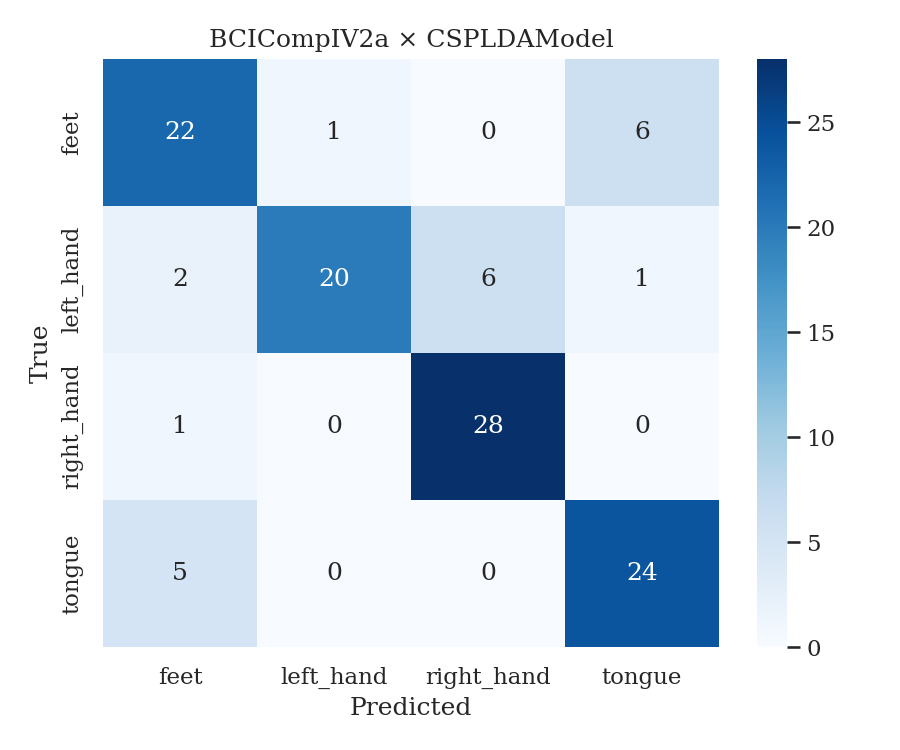

# EEG Classification Report — BCICompIV2a × CSPLDAModel

**Date:** 2026-03-21
**Paradigm:** MotorImagery
**Seed:** 42

---

## 1. Dataset

| Property        | Value |
|-----------------|-------|
| Name            | BCICompIV2a |
| Subjects        | 1 |
| Classes         | feet, left_hand, right_hand, tongue |
| Channels        | 22 |
| Sampling Rate   | 250.0 Hz |
| Trials/Subject  | 576 |

---

## 2. Pipeline

| Stage         | Details |
|---------------|---------|
| Preprocessing | none |
| Model         | CSPLDAModel |
| Trainer       | N/A — classical model |

### 2.1 Preprocessing Details
```
none
```

### 2.2 Model Hyperparameters
```
# n_components: 4
# reg: None
# log: True
```

### 2.3 Trainer Config
```
# N/A — classical model
```

---

## 3. Evaluation Protocol

| Property      | Value |
|---------------|-------|
| Type          | intra_subject |
| Split         | fixed_split |

---

## 4. Results Summary

### 4.1 Core Metrics

| Metric            | Value  |
|-------------------|--------|
| Accuracy          | 0.810 ± 0.000 |
| Balanced Accuracy | 0.810 |
| F1-Macro          | 0.809 |
| Cohen's Kappa     | 0.747 |
| MCC               | 0.751 |
| Chance Level      | 0.250 |


---

## 5. Per-Subject Results

| Subject | Accuracy | Balanced Acc | F1-Macro | Kappa | MCC |
|---------|----------|--------------|----------|-------|-----|
| 1 | 0.810 | 0.810 | 0.809 | 0.747 | 0.751 |

---

## 6. Confusion Matrix


```
[22, 1, 0, 6]
[2, 20, 6, 1]
[1, 0, 28, 0]
[5, 0, 0, 24]
```

---

## 7. F1 Per Class

| Class | F1 |
|-------|----|
| feet | 0.746 |
| left_hand | 0.800 |
| right_hand | 0.889 |
| tongue | 0.800 |

---

## 8. Notes & Observations

Test dataset

---

## 9. References

- Dataset: BCICompIV2a
- Model: CSPLDAModel
