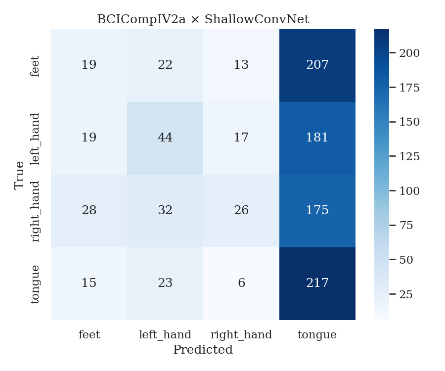

# EEG Classification Report — BCICompIV2a × ShallowConvNet

**Date:** 2026-03-22
**Paradigm:** MotorImagery
**Seed:** 42

---

## 1. Dataset

| Property        | Value |
|-----------------|-------|
| Name            | BCICompIV2a |
| Subjects        | 9 |
| Classes         | feet, left_hand, right_hand, tongue |
| Channels        | 22 |
| Sampling Rate   | 250.0 Hz |
| Trials/Subject  | 576 |

---

## 2. Pipeline

| Stage         | Details |
|---------------|---------|
| Preprocessing | EOG regression removal (channels 22,23,24) |
| Model         | ShallowConvNet |
| Trainer       | provided |

### 2.1 Preprocessing Details
```
EOG regression removal (channels 22,23,24)
```

### 2.2 Model Hyperparameters
```
# n_channels: 22
# n_times: 1125
# n_classes: 4
# dropout: 0.5
```

### 2.3 Trainer Config
```
# n_epochs: 1
# batch_size: 64
# lr: 0.001
# label_smoothing: 0.0
# loss_scale: 1.0
# l2_scale: 0.0
# grad_clip: 0.0
# weight_decay: 0.0
# scheduler: none
# optimizer: adam
# optimizer_kwargs: {}
# input_adapter: CNN2DAdapter
# logger: {'every_n_epochs': 10, 'metrics': ['train_loss', 'val_loss', 'train_acc', 'val_acc']}
# early_stopping: {'patience': 50, 'min_delta': 0.0001, 'monitor': 'val_loss', 'mode': 'min'}
# best_model: None
# checkpoint: None
```

---

## 3. Evaluation Protocol

| Property      | Value |
|---------------|-------|
| Type          | intra_subject |
| Split         | fixed_split |

---

## 4. Results Summary

### 4.1 Core Metrics

| Metric            | Value  |
|-------------------|--------|
| Accuracy          | 0.293 ± 0.062 |
| Balanced Accuracy | 0.293 |
| F1-Macro          | 0.230 |
| Cohen's Kappa     | 0.057 |
| MCC               | 0.077 |
| Chance Level      | 0.250 |


---

## 5. Per-Subject Results

| Subject | Accuracy | Balanced Acc | F1-Macro | Kappa | MCC |
|---------|----------|--------------|----------|-------|-----|
| 1 | 0.440 | 0.440 | 0.381 | 0.253 | 0.281 |
| 2 | 0.284 | 0.284 | 0.192 | 0.046 | 0.085 |
| 3 | 0.302 | 0.302 | 0.200 | 0.069 | 0.127 |
| 4 | 0.250 | 0.250 | 0.101 | 0.000 | 0.000 |
| 5 | 0.241 | 0.241 | 0.192 | -0.011 | -0.015 |
| 6 | 0.250 | 0.250 | 0.191 | 0.000 | 0.000 |
| 7 | 0.250 | 0.250 | 0.101 | 0.000 | 0.000 |
| 8 | 0.267 | 0.267 | 0.137 | 0.023 | 0.063 |
| 9 | 0.353 | 0.353 | 0.265 | 0.138 | 0.248 |

---

## 6. Confusion Matrix


```
[19, 22, 13, 207]
[19, 44, 17, 181]
[28, 32, 26, 175]
[15, 23, 6, 217]
```

---

## 7. F1 Per Class

| Class | F1 |
|-------|----|
| feet | 0.111 |
| left_hand | 0.230 |
| right_hand | 0.161 |
| tongue | 0.417 |

---

## 8. Notes & Observations

ShallowConvNet + EOG removal on BCI2a.

---

## 9. References

- Dataset: BCICompIV2a
- Model: ShallowConvNet
